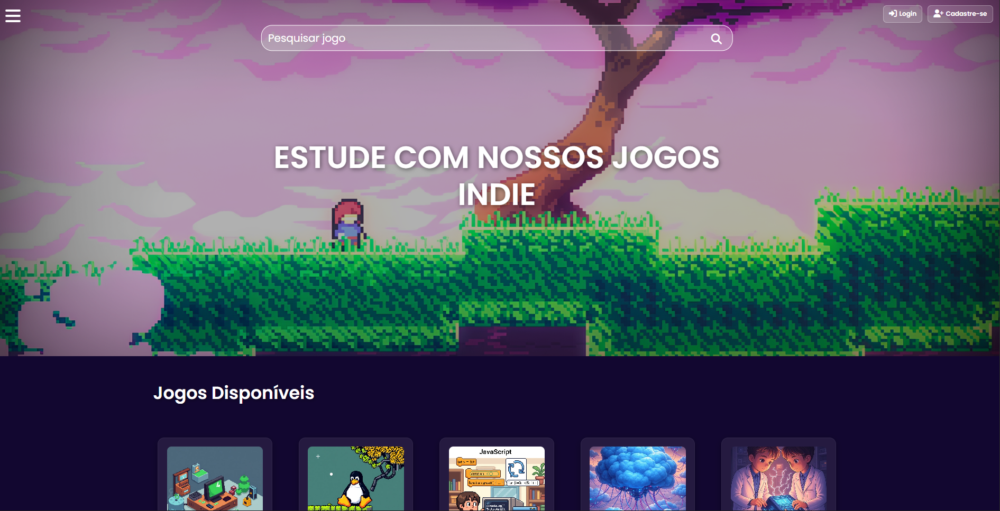

# Tiago Barroso  

  
...
 
  
  
  > - *
Cursando Sistemas para Internet no IFRN.
*
  > - *
Formado técnico em Redes de Computadores pela UFRN
*
  > - *
Desenvolvedor de sistemas com objetivos educacionais.
*
  

    

 
 
 

   

  

 
 
 

<h1 align="center">— Projetos —</h1>

  
  
  

 
 
 

<h1 align="center">— Linguagens & Tecnologias —</h1>

   

 

<!-- Tabela centralizada: badges à esquerda, estatísticas à direita -->
<table align="center">
  <tr>
    <!-- Coluna esquerda: badges (largura fixa) -->
    <td valign="middle" width="240">
      

         
         
         
         
         
         
        
      

    </td>

  <td valign="middle" align="center">

  

  </td>

  </tr>
</table>

 
 

<h1 align="center">— Informações —</h1>

 

<table align="center">
  <tr>
    <td align="center" valign="middle" width="300">
      
    </td>
    <td align="left" valign="middle">
      <blockquote>
        Estou Pesquisando Sobre: <b>Computação Forense</b> no momento.
         
         
        E Trabalhando no Projeto: <b>Note Prompt</b>.
      </blockquote>
    </td>
  </tr>
</table>

 

  <table align="center">
      <tr>
      <td>  
        

    
  
   🔹Tecnologias Mais Usadas

   
  

  - **Figma** (Prototipagem)
  - **Awwwards** / **Dribbble** (Referências de UI/UX)
  - **Photoshop** / **Photopea** / **Pixlr** (Edição de imagens)
  - **Visual Studio Code** / **Apache NetBeans** (Editor de texto)
  - **FontAwesome** / **Bootstrap Icons** (Para icones)
  - **Google Fonts** (Para fontes)
  - **Gemini 2.5 Pro** / **ChatGPT 4.0** (AI para código)
  - **Google Docs** (Documentação)
  - **Lucidchart** (Diagramas)
  - **Microsoft To Do** (Tarefas)
  - **Trello** (Kanban)
      
  

      </td>
      <td>
  

    
   🔹Complementares

   

- Concluí a qualificação *HTML/CSS* pela *Rocketseat* em 2022.
- Concluí a qualificação em *UI/UX* pela *Origamid* em 2022.
  
  

    </td>
    <td>
  

    
    
  🔹 E mais...

  
     

    > - Gosto de aprender novas habilidades e aprender sobre novos assuntos durante o meu tempo livre. Admiro a multidisciplinaridade do conhecimento humano, e, por isto, busco sempre seguir esta filosofia!
    > - Pretendo desenvolver projetos que solucionem problemas do dia a dia para mim e para outras pessoas.  
    > - Como estudante de tecnologia da informação, planejo me qualificar constantemente para acompanhar a evolução e contribuir com a ciência e tecnologia, sempre me especializando e buscando conhecimento em outras partes desta disciplina do conhecimento tão vasta!
    > - Como profissional estou aberto para oportunidades de emprego como estagiário ou júnior.
  

    </td>
    </tr>
  </table>

 
 

  Entre em contato comigo em:

 

     
     

